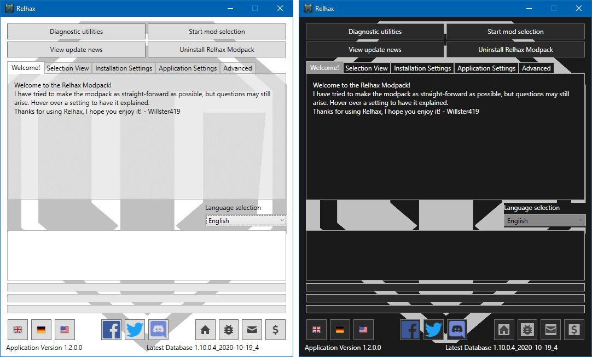
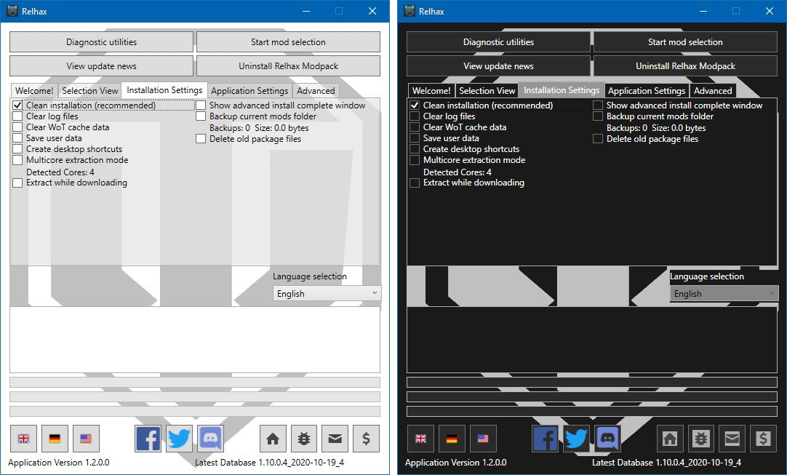
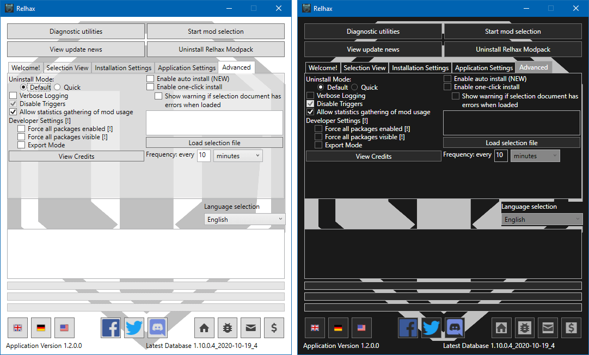
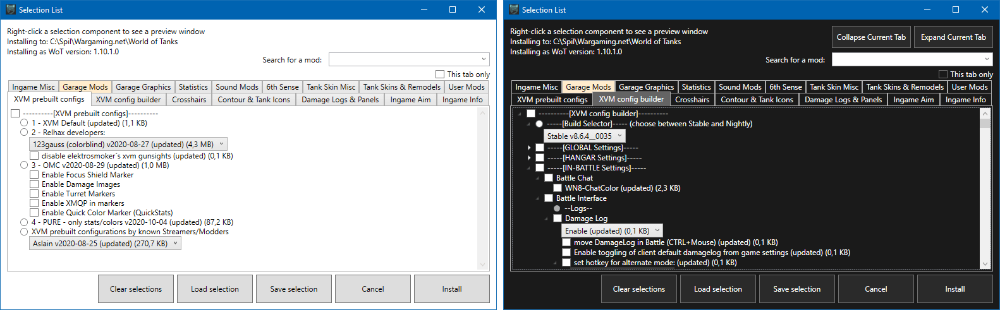
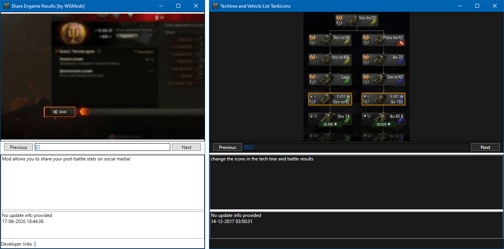
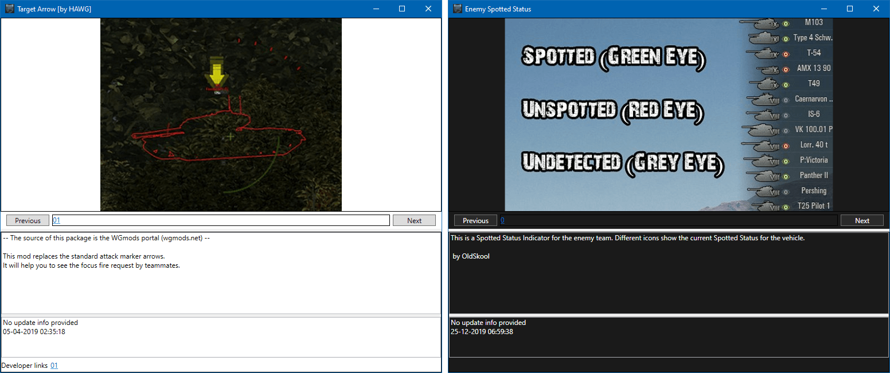

## Attention! The Relhax Modpack will be closing on April 20th, 2022. Thank you to all our volunteers and users for over 5 years of success!

##### SUPPORTED LANGUAGES: [**<ins>English</ins>**](README.md), Deutch, Polski, Français, Español, Pусский.

***

## The Relhax Modpack

**_The fastest <abbr title="World of Tanks">WoT</abbr> modpack installer in the world. A refresh of <abbr title="Odem Mortis Community">OMC</abbr> modpack._** 

| [Virustotal](https://www.virustotal.com/gui/file/0cecd539dbf22f7d0d8ebc04d6f3ebad7cff7c7fee087ea487ea0832e4a06062) |                                           [Download](https://github.com/Willster419/RelhaxModpack/releases/latest)                                           |[License](https://github.com/Willster419/RelhaxModpack/blob/master/LICENSE)
| :---: | :---: | :---: |
||||

<i>The Relhax Modpack ~ Would you rather spend time on your mods, or your gameplay?</i>

---

## 🛡 Description and reason for development

_This project is in dedication of the RELIC Gaming Community, as well as the <abbr title="Odem Mortis Community">OMC</abbr> modpack dev team (includes me, :wink: ). A big thank you to them and their original work, especially to grumpelumpf. He gave the idea and design of the database driver approach, and is the reason why this modpack is where it is today. His work done on the <abbr title="Odem Mortis Community">OMC</abbr> modpack over the years will not be forgotten._

_When I looked at the current modpack installers, they all look the same: in size, in UI, and were all made with the inno setup creator. Many describe these installers as "clunky and slow". Trying to get that perfect mod setup can sometimes take hours. Have you ever had a "modpack setup night"?_

_The goal of this project is to redefine what a modpack installer is, from the template UI to the install engine. Instead of using inno setup, I decided to create my own install engine from scratch in Microsoft's C# programming language. Some of the UI features in this modpack are new (tab category view), and some are kept in line with previous modpacks (right click to preview)._

## 🛡 Modpack Features

### Why would you use this modpack over any other inno setup template modpack?

<b>Improved UI</b> — No more bland looking setup template screens

	<ul>
		<li>Instead of a giant unscrollable list of hard-to-find mods to select from, the mods are presented in tabs, each tab page being a mod catagory. Xvm has a tab page, garage stats have a page, damagelogs have a page, etc. Mods per tab are sorted alphabetically</li>
		<li>For the first time in modpack history, there is a search feature where you can search for "that one mod" you want.</li>
		<li>There are multiple views to display the mod selection list in. Currently we have <abbr title="Odem Mortis Community">OMC</abbr> legacy view and the Relhax default view</li>
		<li>The application allows for DPI and font based application scaling. It is also 4K display ready.</li>
		<li>The Mod selection window and mod preview window are resizeable. The application will remember your last window settings and apply them upon loading the selection list</li>
		<li>The font can be changed to comic sans. This is a critical feature.</li>
		<li>The modpack can inform you if your local installation is out of date. This saves you from running a useless installation.</li>
		<li>The <abbr title="Odem Mortis Community">OMC</abbr> mod preview window has been redesigned, while keeping the familiar user interface:</li>
		<li>The preview window supports image links, sound file links, webpage links, and direct HTML code.</li>
			<ul>
				<li>Pictures load asynchronously. This means that The UI does not lock up waiting for the picture to load.</li>
				<li>The preview window is web-based, meaning you hard drive won't become cluttered with cached pictures.</li>
				<li>Each mod or config can have up to 1.2 million pictures. Other modpacks have only a few, or only 1 picture​</li>
			</ul>
		</ul>

<b>Persistence</b> — Mod selections can be saved

  <ul>
		<li>Like <abbr title="Odem Mortis Community">OMC</abbr> and Aslains, your mods selection can be saved.</li>
		<li>Unlike Aslains, you can save as many mod selections as you want, and save them where ever you like</li>
		<li>Unlike <abbr title="Odem Mortis Community">OMC</abbr>, you can use this selection file to automate the install process (See Automation Section)</li>
	</ul>

<b>Performance</b> — The modpack has to go fast

  <ul>
		<li>For the first time in modpack history, the installation process is multi-threaded, meaning that it can install multiple mods at once. The install process is optimized for 8-core systems.</li>
		<li>The loading and installation times of this modpack vs. Inno setup modpacks have been reduced by up to <b><ins>89%</b></ins> and <b><ins>60%</b></ins> on a standard hard drive using the standard extraction mode. The times are even further reduced for those with WoT installed on an SSD using the multicore extraction mode.</li>
	</ul>

<b>Automation</b> — Install your mods with 1 click, or automatically

	<ul>
		<li>The modpack and be set at command line with a <kbd>/auto-install config_file_name.xml</kbd> switch to automatically install the modpack, with your preference of mods selected. In this situation, you could install without any interaction, and update all your mods in seconds.</li>
	</ul>

<samp>[Click <kbd>►</kbd> to expand]</samp>

### What does the modpack look like?

	
<b>Main Window</b> — Compact and packed with options ...

	

	

	

	
<b>Mod Selection List</b> — Customizable and practical ...

		<figure>
				

			</figcaption>Prefer the <abbr title="Odem Mortis Community">OMC</abbr> style selection view? No problem!<figcaption>
		</figure>

	
<b>Mod Preview & Description Window</b> — Flexible and non-blocking ...

	

	

<samp>[Click <kbd>►</kbd> to expand]</samp>

---

### Additional Information

Latest release notes can be found [here](https://github.com/Willster419/RelhaxModpack/commits/master).

**If you come across a bug or feature request please take one of these actions:**

- Let us know via our [Discord](https://discordapp.com/invite/58fdPvK).
- Report it on our [forum](http://forums.relhaxmodpack.com/).
- If you have a GitHub account, [open an issue](https://github.com/Willster419/RelhaxModpack/issues).

_When you do, please attach the diagnostic .zip file you create by clicking <kbd>Diagnostic Utilities -> Create ZIP file</kbd>_.

<b><ins><pre>If you want to help develop the modpack, I would be glad for the help and I will help set you up with an environment! Thank you!</pre></ins></b>

## 🛡 Download

You can download the modpack in couple of ways, via:
|[Adf.ly Sponsored Link](http://adf.ly/1l28oP)|[Official <abbr title="Wargaming Mods">WGMods</abbr> Portal](https://wgmods.net/392/)|[Direct Download Link](http://bigmods.relhaxmodpack.com/RelhaxModpack/RelhaxModpack.exe)|[GitHub Releases](https://github.com/Willster419/RelhaxModpack/releases)
|:---:|:---:|:---:|:---:|

**If you can spare a few dollars and like the Modpack, [please consider donating on Paypal!](https://www.paypal.com/cgi-bin/webscr?cmd=_s-xclick&hosted_button_id=76KNV8KXKYNG2)**

## 🛡 Credits

- <b><abbr title="Odem Mortis Community">OMC</abbr> Modpack</b> — <i>For giving me an internal structure to start with and improve upon, along with several premade zip files to start with.</i>
- <b>Rkk1945</b> — <i>For helping with code edits and resource support, along with helping with the closed alpha test.</i>
- <i>All the Modpack team members for helping to add mods as quickly as possible.</i>
- <i>Those who helped provide feedback during open alpha and beta testing.</i>

---

## 🛡 FAQ — Frequently Asked Questions

**Why is there such a difference in install times?**

_While Inno setup single-threaded (as far as I can tell), mine is not. What does that mean? Looking at mod zip extraction, for example, when a file is extracted, it is reported to the GUI in a synchronous manner. This means that the modpack can only extract as fast as it can pump events to the GUI for each entry extracted in a zip file. This is where multi-threading come in. You can create a separate thread and have it only extract, and asynchronously report the progress to the GUI. This means three things:_

- _The GUI is not laggy during install_
- _The install is not frozen when the ui thread is blocked, like moving the window for example_
- _The extraction is limited to your hard drive speed, not the processor GUI reporting speed._

_This can be further exploited. If several mods do not interact with each other, (no file over-writes), why not install the mods at the same time? Concurrent installation can reduce install time by up to <b>80%</b> (Depends on HDD/SSD performance)._
_If you want more information, I encourage you to review [this presentation](https://docs.google.com/presentation/d/1H-6YLcEP3XfxeEhF21grP7Ypfw2im300201bz0NAuJI/edit#slide=id.g7bf2f002c6_0_83)._

**I have a perfect selection of mods that I want. Can I save this selection?**

_Yes. Press the save selection button. It will save your config file wherever you tell it to save it. I recommend you save it in the default folder._

**Do I have to install my personal mods/configs myself after this is done?**

_No :smile:. You can put your mods in the "RelHaxUserMods folder", and the installer will add them to the "User Mods" tab. You can install them just like they were regular mods. You can even use it to patch files with the installer's patching system, and install fonts._

**How can I use the "auto-install" option?**

_From the advanced settings tab, load a selection file and check the "auto installation" checkbox in advanced settings. The modpack will automatically check with the server (beta or stable database) for a new db version, and if one is found, an installation is started._

***

### Benchmarks
``Hard drive used in benchmark is a Toshiba 5400 RPM 2.5 inch [laptop hard drive], 8MB cache.``

#### Performance measurements: 
##### Time from program execution to mod selection on a hard drive.

<table>
  <thead>
    <tr>
      <th><abbr title="Odem Mortis Community">OMC</abbr></th>
      <th>Aslain's</th>
			<th><ins>Relhax Modpack</ins></th>
    </tr>
  </thead>
  <tbody>
    <tr>
      <td>48 seconds</td>
      <td>24 seconds</td>
			<td><mark><b>05 seconds</mark></td>
    </tr>
  </tbody>
  <tfoot>
    <tr>
      <td>+90% vs <i>Relhax</i></td>
      <td>+79% vs <i>Relhax</i></td>
			<td><b>N/A</b></td>
    </tr>
  </tfoot>
</table>

##### Time from mod selection to install completion (installing the same number or similar mods) on a hard drive

<table>
  <thead>
    <tr>
      <th><abbr title="Odem Mortis Community">OMC</abbr></th>
      <th>Aslain's</th>
			<th><ins>Relhax Modpack</ins></th>
    </tr>
  </thead>
  <tbody>
    <tr>
      <td>10 seconds</td>
      <td>09 seconds</td>
			<td><mark><b>04 seconds</mark></td>
    </tr>
  </tbody>
  <tfoot>
    <tr>
      <td>+60% vs <i>Relhax</i></td>
      <td>+56% vs <i>Relhax</i></td>
			<td><b>N/A</b></td>
    </tr>
  </tfoot>
</table>
Less is better (seconds)

***
##### Disclaimer

*There are no "Hacks" or illegal mods in the modpack, the name is used for artistic license.* 
*This modpack complies with <abbr title="Wargaming">WG</abbr>'s fair play policy. We try to keep up to date as much as we can with their policy, but this is by no means an official guarantee.*
***
[downloadURL]: https://wgmods.net/392/ "Download"
Readme Design by [@Nullmaruzero](https://github.com/Nullmaruzero/)
Minor Maintenance by [@The Illusion](https://github.com/Arkhorse)
